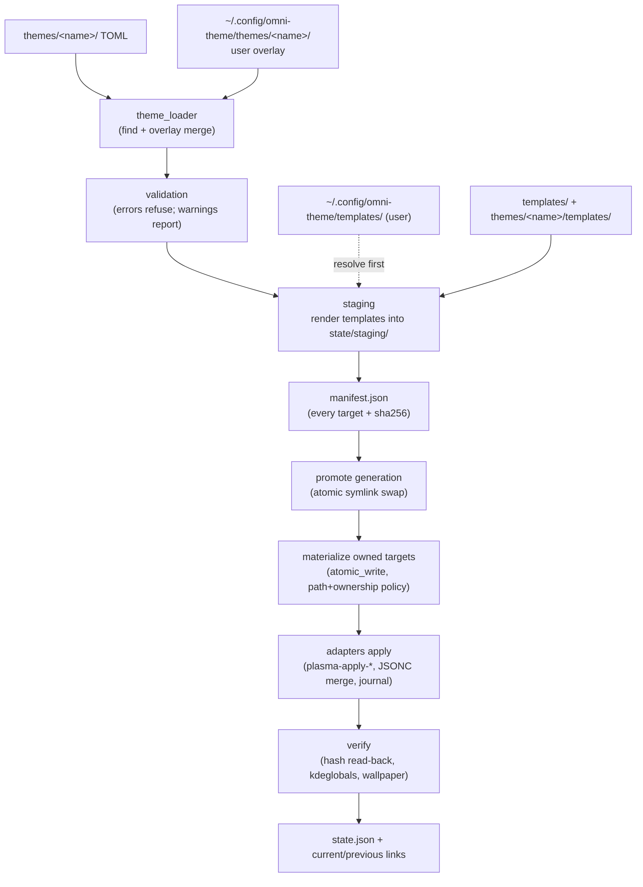

# Architecture — omni-theme-cachy

One semantic palette drives every supported desktop surface. The engine is
a **generator plus orchestrator**: it turns TOML theme data into per-app
configuration files and hands *application* to each target's official tool
(`plasma-apply-colorscheme`, …). It never hand-edits live desktop state.

## Module map

| Module | Role |
|---|---|
| `core/theme_model.py` | Immutable value objects: `ThemeMeta`, `Palette`, `Surfaces`, `Theme` |
| `core/theme_loader.py` | TOML parsing, theme discovery/resolution, user-overlay deep merge |
| `core/color.py` | Color math (`mix`, contrast), surface value classification |
| `core/validation.py` | Rule checks (required roles, WCAG contrast, syntax) as `Issue` records |
| `core/renderer.py` | Strict `{{ placeholder }}` substitution with a closed helper set |
| `core/targets.py` | Explicit template→destination registry (`templates/targets.toml`) |
| `core/staging.py` | Renders the full theme into a pristine staging dir + `manifest.json` |
| `core/state.py` | Generations, atomic pointer swaps, `state.json`, conflict inspection |
| `core/activation.py` | The pipeline: stage → promote → materialize → adapters → verify |
| `core/adapters.py` | Desktop-agnostic adapter contract and registry |
| `core/filesystem.py` | XDG roots, atomic writes, path/ownership policy |
| `core/engine.py` | `ThemeEngine` facade wiring everything together |
| `core/cli.py` | `omni` command surface (exit codes, `--json`, `--yes`) |
| `core/events.py` | Lifecycle event dispatcher (`pre_activate`, `post_verify`, …) |
| `adapters/` | KDE, GTK, VS Code, Konsole integrations |

The core never imports a concrete adapter. Composition happens at the edges
(`build_default_registry()` in `adapters/__init__.py`).

## Data flow



## Design principles

1. **Generate, don't hand-edit.** Only files the engine generated are
   written; application of desktop state is delegated to KDE's own tools.
2. **Stage, then promote atomically.** A failed switch leaves the old or
   the new theme, never a mixture — see [ACTIVATION.md](ACTIVATION.md).
3. **User overrides always win.** Overlay > user template > theme > built-in
   — see [OVERRIDES](../user/OVERRIDES.md) and [THEME_MODEL.md](THEME_MODEL.md).
4. **Zero runtime dependencies.** Python ≥ 3.11 stdlib only (`tomllib`,
   `string.Template`, `subprocess`, `pathlib`).
5. **Unsupported is not failure.** Adapters probe capability per machine and
   are skipped with a reason; a theme is never half-promoted because one app
   could not be themed — see [ADAPTERS.md](ADAPTERS.md).
6. **Ownership is explicit.** The engine writes only what it generated,
   records hashes in `state.json`, and refuses (or requires `--force` for)
   targets that diverged — see [OWNERSHIP_AND_SECURITY.md](OWNERSHIP_AND_SECURITY.md).

## Runtime layout (all user-local)

```
~/.config/omni-theme/          user overlays + user templates
~/.local/share/color-schemes/  generated OmniTheme.colors (engine-owned)
~/.local/state/omni-theme/     generations/, current, previous, staging/,
                               backups/, state.json, adapters/ journals
```

XDG base directories are honored at call time. Nothing is written outside
these roots (enforced in `core.filesystem.validate_write_target`).

## Trust boundary in one sentence

Themes are **data**: palettes, surfaces and templates are inert text with a
closed substitution grammar, and nothing from a theme directory is ever
executed — see [OWNERSHIP_AND_SECURITY.md](OWNERSHIP_AND_SECURITY.md) for
what is enforced today versus what remains design intent.
